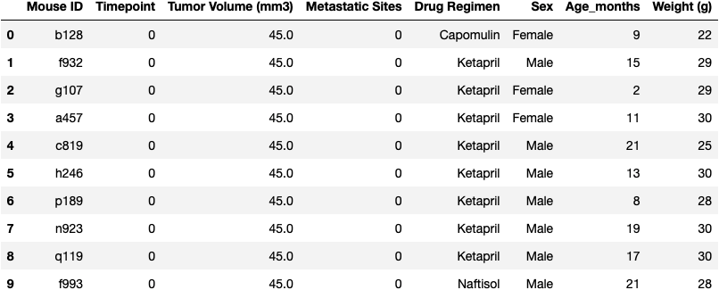
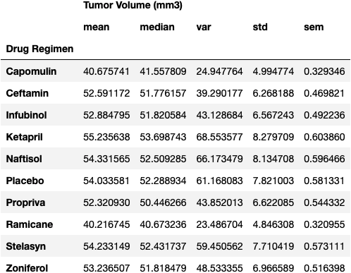
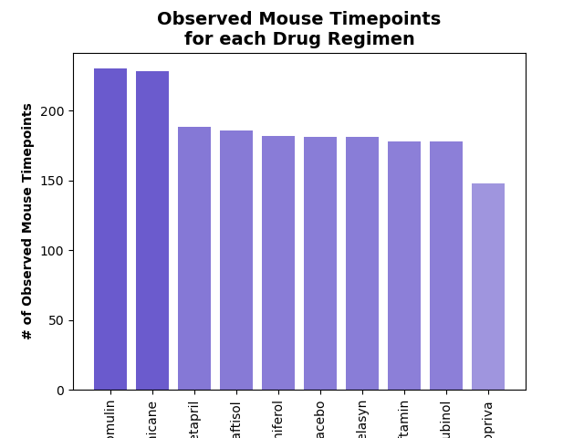
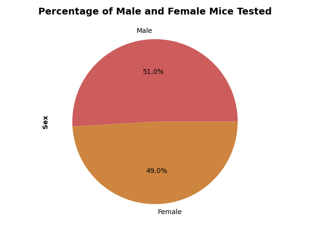
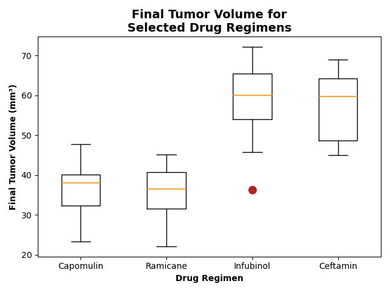
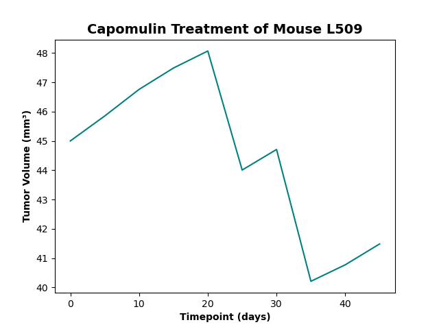
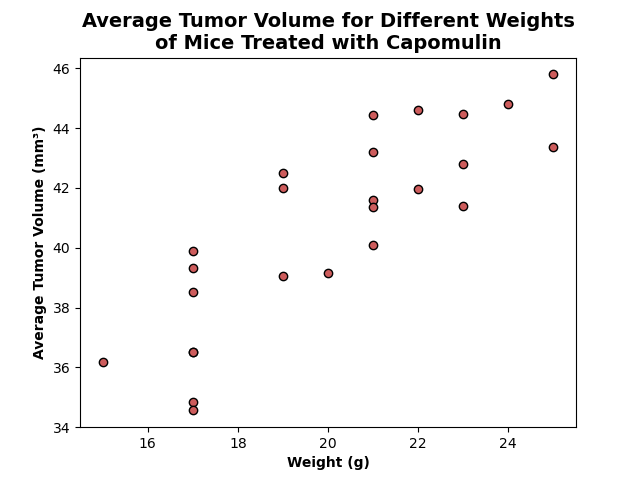
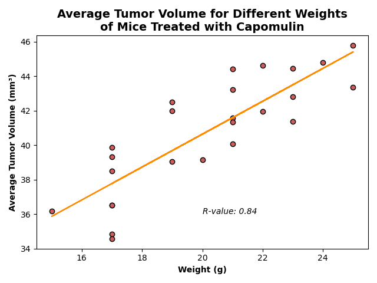

# Matplotlib Challenge: Pymaceuticals

**Student name:** Tania Barrera

---

- [Background](#background)
- [Summary](#summary)
  - [Prepare the data](#prepare-the-data)
  - [Generate summary statistics](#generate-summary-statistics)
  - [Create bar charts and pie charts](#create-bar-charts-and-pie-charts)
  - [Calculate quartiles, find outliers, and create a box plot.](#calculate-quartiles-find-outliers-and-create-a-box-plot)
  - [Create a line plot and a scatter plot.](#create-a-line-plot-and-a-scatter-plot)
  - [Calculate correlation and regression.](#calculate-correlation-and-regression)
- [References](#references)

---

This repo contains my work for the fifth weekly challenge of the UofT SCS edX Data Bootcamp.

**Notebook:** [Pymaceuticals/pymaceuticals_analysis_tsbarr.ipynb](Pymaceuticals/pymaceuticals_analysis_tsbarr.ipynb)

---

## Background

You've just joined Pymaceuticals, Inc., a new pharmaceutical company that specializes in anti-cancer medications. Recently, it began screening for potential treatments for squamous cell carcinoma (SCC), a commonly occurring form of skin cancer.

As a senior data analyst at the company, you've been given access to the complete data from their most recent animal study. In this study, 249 mice who were identified with SCC tumors received treatment with a range of drug regimens. Over the course of 45 days, tumor development was observed and measured. The purpose of this study was to compare the performance of Pymaceuticals’ drug of interest, Capomulin, against the other treatment regimens.

The executive team has tasked you with generating all of the tables and figures needed for the technical report of the clinical study. They have also asked you for a top-level summary of the study results.

## Summary

This assignment is broken down into the following tasks:

1. Prepare the data.

2. Generate summary statistics.

3. Create bar charts and pie charts.

4. Calculate quartiles, find outliers, and create a box plot.

5. Create a line plot and a scatter plot.

6. Calculate correlation and regression.

7. Submit your final analysis.

### Prepare the data

Steps:

1. Input data.
2. Merge into a single dataframe.
3. Clean out duplicates.

Result:

### Generate summary statistics

Steps:

1. Get the mean, median, variance, standard deviation, and standard error of `Tumor Volume (mm3)` for each `Drug Regimen`.
2. Display data in a new dataframe with `Drug Regimen` as the index.

Result:

### Create bar charts and pie charts

Steps:

1. Display two identical bar charts with the number of `Mouse ID`/`Timepoints` measured for each drug regimen:
   1. One generated using the pandas `.plot()` method

        Result:

        

   2. One using the `mathplotlib.pyplot` interface.

        Result:

        

2. Display two identical pie charts with the percentage of female and male mice used in the study:
   1. One generated using the pandas `.plot()` method

        Result:

        

   2. One using the `mathplotlib.pyplot` interface.interface.

        Result:

        

### Calculate quartiles, find outliers, and create a box plot.

Steps:

1. Find the last `Timepoint` for each `Mouse ID`.
2. Get the final tumor volumes from four selected drug regimens only
3. Calculate the interquantile range (IQR) for each of these regimens
4. Use the IQR to identify potential outliers
5. Generate a boxplot showing the distribution of final tumor volumes of each of the four drug regimens, making sure the outliers are clearly marked.

Result:

### Create a line plot and a scatter plot.

Steps:

1. Generate a lineplot that shows how the `Tumor Volume (mm3)` changed over the different `Timepoints` for a single mouse treated with Capomulin.

    Result:

    

2. Generate a scatter plot showing the `Average Tumor Volume (mm3)` of mice by their `Weight (g)` for the Capomulin regimen.

    Result:

    

### Calculate correlation and regression.

Steps:

1. Run a linear regression model between mouse `Weight (g)` and `Average Tumor Volume (mm3)` for the Capomulin regimen.
2. Get the correlation coefficient from this model.
3. Plot the model on the previous scatter plot to visualize the relationship between the two variables.

Result:

## References

Challenge instructions and input file, as well as some code sections that were adapted from the UofT SCS EdX Data Bootcamp class activities:

© 2022 edX Boot Camps LLC. Confidential and Proprietary. All Rights Reserved.

Some other code sections were adapted from other sources, specific explanations are found within the code comments:

| Purpose | URL |
| :- | :- |
| How to save a pandas dataframe to an image | https://pypi.org/project/dataframe-image/ |
| How to work with colormaps and matplotlib | https://www.analyticsvidhya.com/blog/2020/09/colormaps-matplotlib/ |
| How to add alpha to a colormap | https://www.tutorialspoint.com/add-alpha-to-an-existing-matplotlib-colormap |
| Documentation for the linear regression model and finding correlation coefficient | https://docs.scipy.org/doc/scipy/reference/generated/scipy.stats.linregress.html#scipy.stats.linregress |
